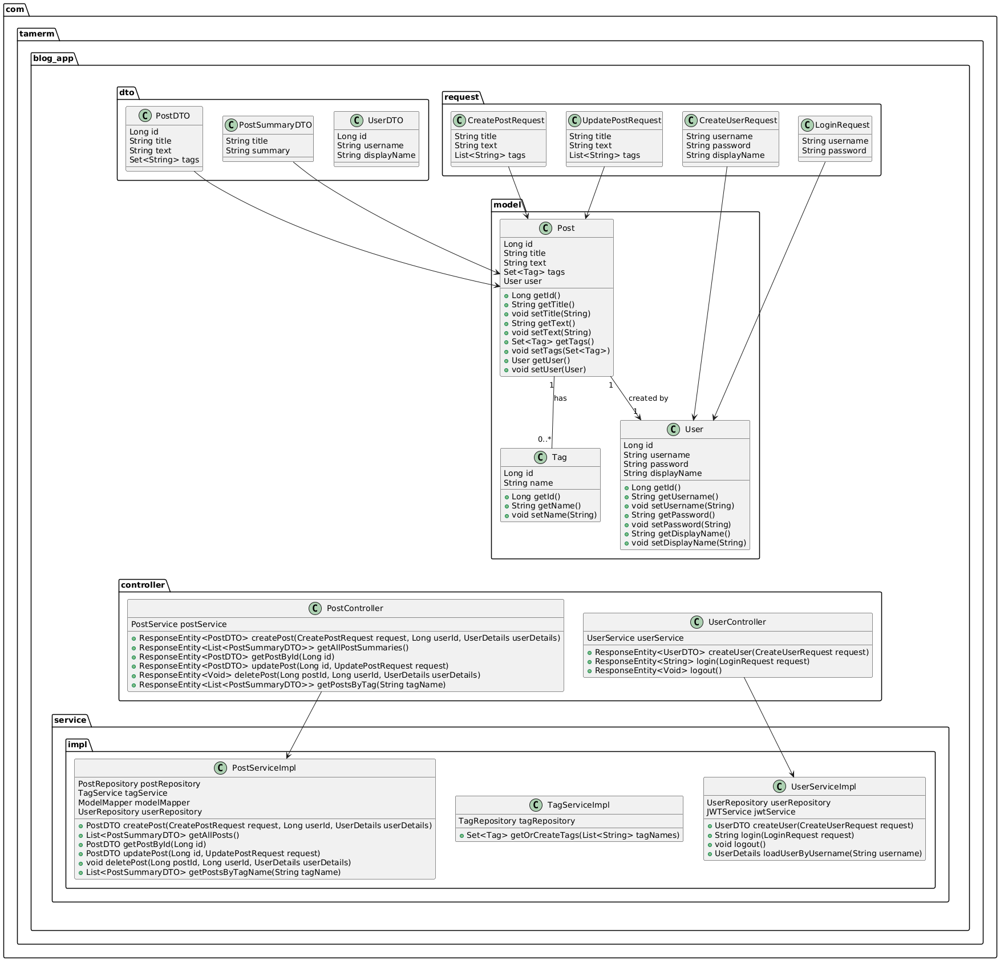

# Blog Application

## Description

Blog Application is a backend API designed to manage a blog platform. The project is developed with Spring Boot and
follows clean architecture, design patterns and SOLID principles. The application will evolve in multiple phases,
starting with basic blog post management and gradually incorporating user authentication, tagging, logging, and advanced
features such as microservices and cloud deployment.

## Structure



## Released Versions

### Version 0.1.0

- Create blog posts with a title and text.
- View a simplified list of all blog posts with title and summary.
- Update the title and text of blog posts.
- Add or remove tags from blog posts.
- Retrieve all blog posts with a specific tag.
- Use H2 database for initial data setup.
- Write unit and integration tests.

### Version 0.2.0

- Add user management functionality.
- Implement user authentication using JWT.
- Allow users to view other users' posts.
- Enable users to delete their own posts.
- Add API documentation using Swagger.
- Implement logging using Logback.
- Migrate the database to MySQL.
- Dockerize the application.

## Planned Versions

### Version 0.3.0

- Add support for images and videos in posts.
- Implement search and pagination.
- Integrate Hibernate Search and SonarQube.

### Version 0.4.0

- Transition to a microservices architecture.
- Use Kafka or RabbitMQ for inter-service communication.
- Implement CI/CD pipelines.
- Deploy the application to the cloud.

## Setup Instructions

1. **Clone the repository**
   ```bash
   git clone https://github.com/tamermurtazaoglu/Blog-App.git
   ```

2. **Navigate to the project directory**
   ```bash
   cd Blog-App
   ```

3. **Set up the database**
   - **For H2 (default for development)**: No additional setup is required.
   - **For MySQL (production)**: Ensure you have MySQL installed and running. Update the `application.properties` file with your MySQL database credentials.


4. **Run the application**
   ```bash
   mvn spring-boot:run
   ```

5. **Run the tests**
   ```bash
   mvn test
   ```

6. **(Optional) Build the Docker image**
   ```bash
   docker build -t blog-app .
   ```

7. **(Optional) Run the application using Docker**
   ```bash
   docker-compose -f src/main/resources/docker-compose.yml up
   ```

## Technical Features

- Java 21
- Spring Boot
- Spring Security
- Maven or Gradle
- H2 and MySQL databases
- Docker
- JWT (JSON Web Token)
- Swagger
- Logback
- TestContainers
- Hibernate Search
- Elasticsearch
- SonarQube
- RabbitMQ
- CI/CD Pipelines
- Cloud Deployment


